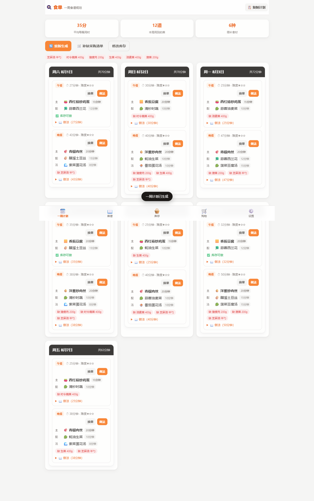
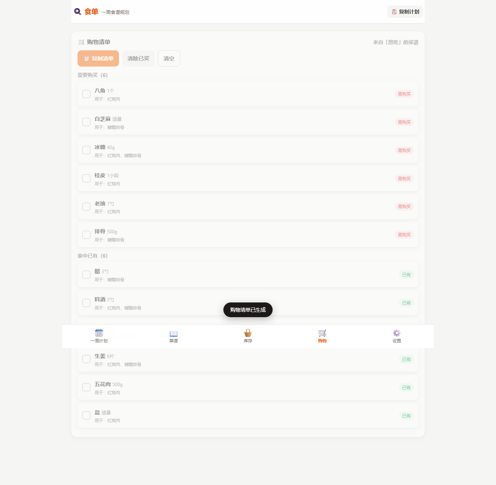

# 食单 · 一周食谱规划

> 输入食材，自动安排一周三餐；想吃什么，自动生成采购清单。手机、电脑都能用，部署到家庭服务器后**全家人实时共享同一份数据**。

食单是一个**纯前端、零依赖**的居家菜谱规划工具：内置 64 道家常菜，支持自建菜谱和批量导入外部菜谱，根据你登记的库存食材自动排出一周的午餐和晚餐（含配菜与做法），并能按家庭人数、小孩年龄、忌口偏好智能调整。

---

## ✨ 功能特性

### 两个核心流程

1. **我有食材 → 安排一周**
   在「库存」页登记买回来的菜，一键生成 7 天（可设 5 天）的午餐和晚餐计划（可在设置中开启「只计划晚餐」）。每餐保持一荤一素，晚餐额外配汤，并附每道菜的做法、用时和难度。

2. **我想吃这些菜 → 自动买菜**
   在「菜谱」页勾选想吃的菜，自动汇总所需食材，区分「需要购买 / 可选 / 家中已有」，数量按菜谱用量自动合并，可一键复制成文字清单。

### 更贴心的细节

- 👨‍👩‍👦 **家庭饭量**：设置成人人数、小孩人数和年龄，小孩饭量随年龄自动调整（5 岁 ≈ 0.5 成人份，8 岁 ≈ 0.65，12 岁 ≈ 0.9），所有用量和购物清单按全家合计份量自动缩放
- 🥗 **一荤一素**：每餐强制荤素搭配，缺荤补荤、缺素补素，晚餐再加一道汤；开启「丰盛晚餐」后晚餐排满两荤一素一汤
- ⏱️ **时间分级**：午餐适合快速准备（默认 ≤25 分钟），晚餐自动放宽 50%
- 🚫 **忌口**：全家辣度和小孩辣度分开设置（默认小孩不辣），排菜时自动避开辣菜
- 🔵 **缺料替代**：库存里有可替代食材时，用蓝色标记推荐（如缺猪里脊可用猪瘦肉）
- 📥 **导入菜谱**：支持文档（txt / md / Word）、网页链接、截图文字、直接粘贴，自动解析菜名、食材、步骤，导入后与内置菜谱共同参与排菜
- ✍️ **自建菜谱**：随时添加自己的拿手菜
- 📱 **PWA**：可添加到手机/电脑主屏幕，首次访问后支持离线使用
- 🔒 **数据私有**：默认仅存浏览器本地；部署到家庭服务器后，家人打开同一地址即共享同一份数据，实时同步，数据不出家庭内网
- 👨‍👩‍👧 **家庭共享**：库存、菜谱、计划、购物清单全家人共用，任何一台设备修改，其他设备即时更新；支持 JSON 导出 / 导入迁移

## 📸 界面预览

| 首页 | 一周计划 | 购物清单 |
| --- | --- | --- |
|  |  |  |

## 🚀 快速开始

项目是纯静态文件，不需要安装任何依赖。

### 方式一：直接打开（最简单）

双击 `index.html` 即可在浏览器使用。此方式不支持离线缓存和链接抓取（建议用方式二）。

### 方式二：本地服务（推荐）

需要 Node.js（≥ 18，Windows 可在 [nodejs.org](https://nodejs.org) 下载）。

```powershell
cd FoodArrangement
.\serve.ps1
```

脚本会自动启动零依赖静态服务器并打开浏览器（默认端口 8765），也可以手动运行：

```bash
node server.js 8765
```

> **家庭共享**：此模式下运行时数据（库存、菜谱、计划、购物清单、设置）保存在服务器 `data/state.json`，全家人通过 `http://电脑IP:8765` 访问即共享同一份数据，任何修改都会**实时推送到其他设备**（浏览器已打开的页面无需刷新）。数据仅存在于家庭内网，不会上传到任何外部服务器；浏览器端 localStorage 降级为离线缓存，服务器不可达时应用照常可用。
>
> - **备份**：复制 `data/state.json` 文件即可
> - **重置服务器数据**：停止服务后删除 `data/state.json`，重启后任一设备重新打开页面时会被询问是否上传本机数据（可点取消，不自动播种）
> - 家庭首次部署时，任一设备浏览器里的现有数据会在询问确认后上传为共享数据（无需手动导出导入）

### 方式三：手机访问

1. 手机和电脑连接**同一个 Wi-Fi**
2. 电脑上运行 `ipconfig` 查看 IPv4 地址（如 `192.168.x.x`）
3. 手机浏览器打开 `http://电脑IP:8765`
4. 手机浏览器菜单「添加到主屏幕」，即可像 App 一样使用

> 打不开时，通常是 Windows 防火墙拦截了 8765 端口，请在防火墙中放行 Node.js 或该端口。

### 方式四：部署到公网

整个文件夹是纯静态文件，可以直接托管到 GitHub Pages、Netlify、Vercel 等平台。注意：部署后「链接抓取」的本地代理不可用，被跨域限制的网站需手动复制文字粘贴。

## 📖 使用指南

### 一周计划

1. 进入「库存」页：常用食材点一下加入、再点一下移除，也可以自由输入
2. 点击「🍳 用这些食材安排一周」
3. 在「一周计划」页查看每天午餐/晚餐：荤素搭配、用时、缺料提示
4. 缺的食材可一键生成补购清单；单餐可「换菜」；「📋 复制计划」可粘贴到备忘录

### 购物清单

1. 进入「菜谱」页，勾选想吃的菜（可搜索菜名或食材）
2. 点击「✅ 已选 N 道 · 生成购物清单」
3. 清单按「需要购买 / 可选 / 家中已有」分组，按全家份量合并数量，支持勾选已买、复制清单

### 设置

| 设置项 | 说明 |
| --- | --- |
| 家庭饭量 | 成人/小孩人数、小孩年龄（自动建议饭量，可微调） |
| 忌口 | 全家辣度、小孩辣度（不辣 / 微辣 / 正常），修改后计划自动重新生成 |
| 每周天数 | 5 天或 7 天 |
| 只计划晚餐 | 开启后每天只排晚餐（含配菜和汤），不排午餐 |
| 丰盛晚餐 | 晚餐排满两荤一素一汤，适合 3 人以上家庭（默认一荤一素一汤） |
| 快手优先 | 午餐快手上限（分钟），晚餐自动放宽 50% |
| 缺料容忍度 | 每道菜允许缺几种食材仍会被选中 |
| 导出 / 导入 | 库存、自建/导入菜谱、设置以 JSON 备份和迁移 |

### 导入菜谱

「菜谱 → 📥 导入菜谱」支持：

- **文档**：`.txt` / `.md` / Word（`.docx`），自动提取文字
- **链接**：粘贴菜谱网页链接，由本地服务代理抓取（部分网站禁止抓取时可复制文字粘贴）
- **截图**：选择截图，在线识别其中的文字（中文效果较好，需联网）
- **粘贴**：直接粘贴任意菜谱文字

解析结果以卡片预览，可修改菜名、分类、用时、食材、步骤后再导入。导入的菜谱带「导入」标记，与内置菜谱共同参与排菜、替代推荐和购物清单。

## ⚙️ 工作原理

### 计划生成算法（`core.js`）

1. **食材匹配**：库存名称归一化（含同义词映射，如 番茄→西红柿），按“缺料数量 / 覆盖率”给每道菜打分
2. **候选排序**：缺料少优先 → 用时短优先 → 难度低优先，同分时优先自带蛋白质的菜
3. **荤素约束**：每餐强制“一荤一素”——主菜缺荤补荤（荤菜/水产/蛋豆），缺素补素（素菜/凉菜），晚餐额外配汤
4. **时间分级**：午餐主菜不超过快手上限，晚餐按 1.5 倍放宽；配菜用更短的时限
5. **忌口过滤**：按全家和小孩中更严格的辣度筛选；实在无菜可选时退而求其次保证有菜吃
6. **重复控制**：主菜 5 餐内不重复、配菜 3 餐内不重复
7. **份量换算**：全家合计人份 ÷ 菜谱基准人份，自动缩放食材用量（克按 5 取整，个数按 0.5 取整）

### 替代推荐（`core.js`）

内置食材替代组（如 猪里脊↔猪瘦肉、嫩豆腐↔老豆腐、生菜↔油麦菜↔时令蔬菜、香菇↔木耳等），缺料时从库存中查找同组食材，以蓝色标记推荐。

### 文本解析（`parser.js`）

导入功能将自由文本按“标题 / 食材（含用量）/ 做法步骤”分段解析，自动猜测分类（荤/素/水产/汤羹/主食/凉菜）和用时，结果可编辑后入库。

## 📁 项目结构

```text
FoodArrangement/
├─ index.html              页面入口
├─ styles.css              样式（移动优先，电脑自适应）
├─ recipes.js              内置菜谱库（64 道）
├─ core.js                 规划算法：匹配 / 荤素约束 / 忌口 / 替代 / 份量
├─ parser.js               导入菜谱的文本解析器
├─ storage.js              本地存储（localStorage）与数据迁移
├─ sync.js                 家庭共享同步（对账 / SSE 实时接收 / 离线回退）
├─ app.js                  界面与交互逻辑
├─ manifest.webmanifest    PWA 清单（可添加到主屏幕）
├─ sw.js                   Service Worker（离线缓存）
├─ server.js               零依赖静态服务器 + 链接抓取代理
├─ serve.ps1               一键启动脚本（Windows）
├─ docs/screens/           README 界面截图
├─ data/state.json         家庭共享数据（运行时自动生成，备份它即可）
└─ .gitignore
```

## 🛠️ 技术栈

- 原生 HTML / CSS / JavaScript，**无构建工具、无运行时依赖**
- Node.js（≥18）仅用于本地静态服务与链接抓取代理，核心功能不依赖后端
- 数据持久化：服务器 `data/state.json`（家庭共享，原子写入）+ 浏览器 `localStorage`（离线缓存）
- 实时同步：SSE（Server-Sent Events）推送，零依赖实现
- 离线能力：Service Worker + PWA manifest
- 截图文字识别：Tesseract.js（可选，按需从 CDN 加载）
- Word 文档读取：Mammoth.js（可选，按需从 CDN 加载）

## 🔒 数据与隐私

- 通过 `node server.js` 或 Docker 部署时，库存、菜谱、计划、设置保存在服务器的 `data/state.json`，**仅在家庭内网中共享**，不会上传到任何外部服务器；其余使用方式（直接打开文件、静态托管）数据仍保存在浏览器本地
- 浏览器端 localStorage 作为离线缓存：服务器不可达时（断网、服务器停机）应用照常使用，恢复连接后自动双向对齐
- 服务器校验请求 Host（防 DNS rebinding）：局域网 IP / localhost / 主机名可直接访问；自定义域名需设置环境变量 `SHIDAN_HOSTS`（逗号分隔）放行
- 「链接抓取」由本地 `server.js` 代理完成，网页内容仅在内存中处理，不落盘、不上传
- 截图识别在浏览器本地执行（Tesseract.js WASM），仅语言数据从 CDN 下载
- 换设备时使用「设置 → 导出/导入」迁移数据
- 本项目不含任何 API Key、账号或网络服务配置，开箱即用

## 🧪 开发与测试

```powershell
# 语法检查
node --check core.js
node --check parser.js
node --check app.js

# 核心算法快速验证（Node 环境）
node -e "const R=require('./recipes.js'),C=require('./core.js');const p=C.planWeek(R,[],{days:7,servings:2.5,quick:true,maxMissing:2,quickLimit:25,maxSpice:0});console.log('餐数',p.days.length*2,'平均',p.stats.avgMinutes,'分钟')"
```

仓库内不包含自动化测试套件；开发过程中使用 Node 脚本验证核心算法、Playwright 临时脚本验证界面流程（不在仓库中保留）。

## ❓ 常见问题

- **为什么我的菜没被选进计划？** 计划优先选“缺料少、用时短”的菜，且受忌口限制；请检查缺料容忍度和快手上限，或单餐点「换菜」。
- **换手机/电脑后数据没了？** 用「设置 → 导出数据」备份，新设备导入；或直接使用家庭共享模式（方式二），所有设备访问同一地址即同步。
- **手机上改的怎么同步到电脑？** 家庭共享模式下无需任何操作：任何设备上的修改会实时推送到其他已打开的页面；离线时的修改会在恢复连接后自动上传。
- **链接抓取失败？** 部分网站禁止自动抓取，把网页文字复制后粘贴到导入框即可。
- **手机打不开？** 确认同一 Wi-Fi、防火墙放行 8765 端口，并检查电脑 IP。

## 🗺️ 后续计划

- [ ] 早餐安排与更多内置菜谱
- [ ] 更多忌口类型（香菜、猪肉、素食等）
- [ ] 热量与营养估算
- [x] 多端数据同步（家庭服务器模式，SSE 实时推送）
- [ ] 按周记录实际饭量，自动校准小孩份量

## 📄 开源协议

本项目采用 MIT 协议开源。发布前请自行添加 `LICENSE` 文件（可参考 [MIT License](https://opensource.org/license/mit) 模板，作者名填写你自己的名字）。
